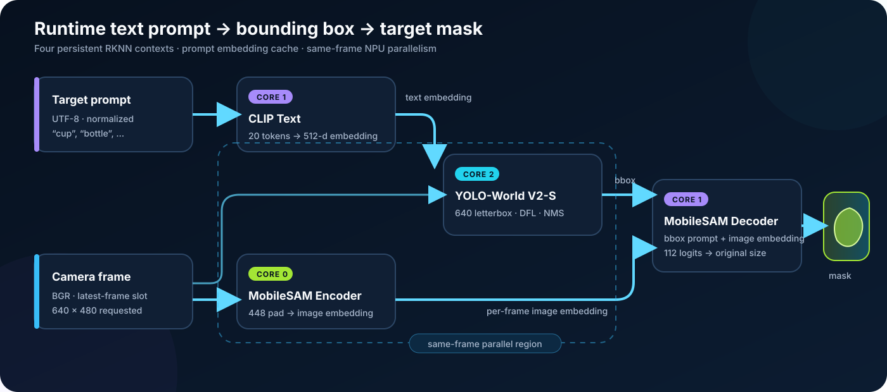
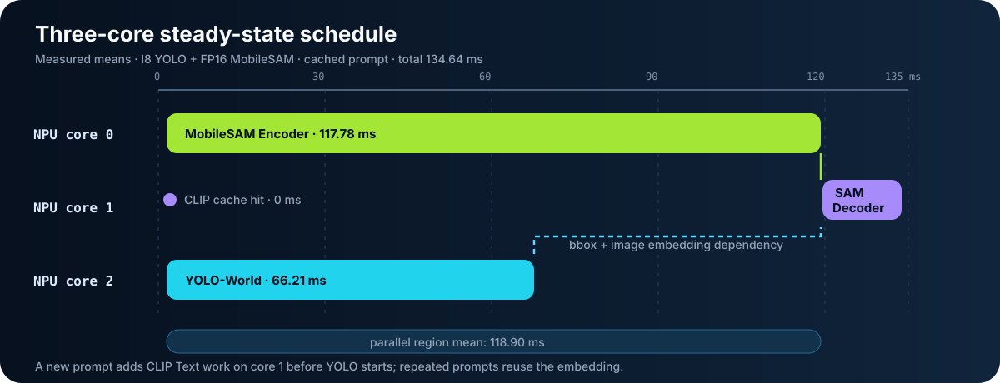
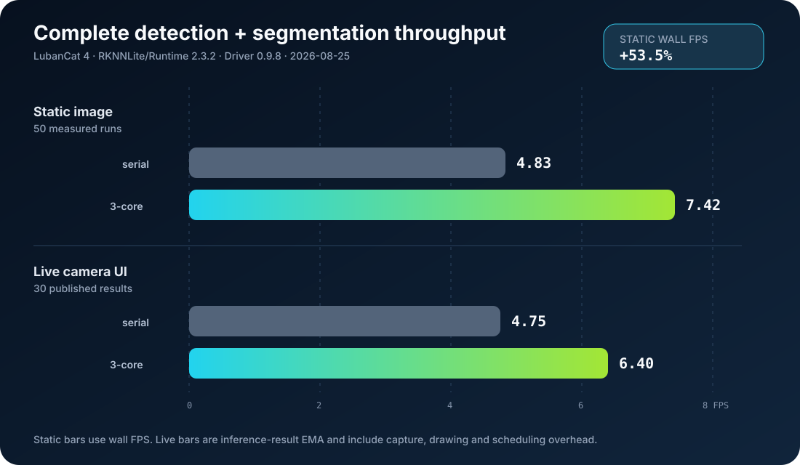

# YOLO-World + MobileSAM on RK3588


在 RK3588 / 鲁班猫 4 上，用运行时文本提示完成 `目标名称 -> bbox -> mask` 的实时定位。项目常驻加载 CLIP Text、YOLO-World V2-S 和 MobileSAM 四个 RKNN 模型；修改提示词时无需重启或重载模型，并利用三核 NPU 并行提高完整检测与分割链路的帧率。

> Runtime text-prompted object detection and segmentation for RK3588, with a live camera UI and explicit three-core NPU scheduling.

## 已实现

- 网页实时界面：SSH 端口转发后，一边看摄像头，一边输入新的目标名称。
- OpenCV 桌面窗口：适合直接在板端图形桌面运行。
- 真动态提示词：目标变化后重新计算 CLIP 文本特征；相同提示词命中内存缓存。
- YOLO-World bbox 到 MobileSAM mask：显示检测框、置信度、半透明 mask 和主轮廓。
- 三核 NPU：同一帧的 YOLO 与 MobileSAM Encoder 并行，Decoder 在 bbox 产生后执行。
- 静态图片验证、动态换词验证、串行/三核基准测试。
- 27 项不依赖 RKNN 硬件的单元测试，以及 GitHub Actions 和发布内容扫描。



## 已验证环境

| 项目                 | 已验证值                     |
| ------------------ | ------------------------ |
| 开发板                | 鲁班猫 4 / RK3588 系列 NPU    |
| RKNNLite / Runtime | 2.3.2                    |
| RKNPU Driver       | 0.9.8                    |
| 摄像头                | V4L2，实测节点 `/dev/video11` |
| 默认检测模型             | YOLO-World V2-S I8       |
| 默认调度               | `three-core`             |
| 板端测试               | 27/27 通过                 |

这些值记录的是一次已完成的真机验证，不代表所有固件、摄像头和 RKNN SDK 组合都兼容。部署到其他系统时，应让 RKNNLite Python wheel、Runtime 和驱动版本相互匹配。

## 最快开始：SSH 网页界面

仓库不包含模型。先按 [模型说明](docs/MODELS.md) 把五个 `.rknn` 文件放进板端仓库的 `model/`；默认运行只需要其中四个，FP16 YOLO 用于精度对照。

Windows PowerShell 中执行：

```powershell
ssh -t -L 18080:127.0.0.1:8080 lubancat "cd /home/cat/yolo-world-mobilesam-rk3588 && exec python3 python/realtime_target_ui.py --ui web --device /dev/video11 --bind 127.0.0.1 --port 8080 --target cup"
```

然后打开 `http://127.0.0.1:18080/`。页面可输入英文或中文目标名称，点击“定位”立即切换；MobileSAM 也可随时启停。服务默认只监听板端回环地址，不直接暴露在局域网。

如果仓库位于其他板端目录，修改命令中的 `cd` 路径。摄像头节点不确定时运行：

```bash
v4l2-ctl --list-devices
```

完整安装、模型传输和故障排查见 [部署指南](docs/DEPLOYMENT.md)。

## 静态图片验证

```bash
python3 python/rknn_target_pipeline.py \
  --image data/test.jpg \
  --target cup \
  --output-dir results/my_cup
```

输出：

- `01_yolo_detection.png`
- `02_mobilesam_mask.png`
- `03_target_contour.png`
- `metrics.json`

未检测到目标时进程返回码为 `2`；运行错误返回非零状态。

## 验证动态换词是真的

以下命令在同一个 RKNNLite 进程中依次检测 `cup -> cat -> cup`：

```bash
python3 python/verify_dynamic_targets.py \
  --image data/test.jpg \
  --targets cup cat cup \
  --with-sam \
  --output-dir results/dynamic_check
```

查看 `results/dynamic_check/dynamic_targets.json`。第三次 `cup` 应出现：

```json
{
  "embedding_cache_hit": true,
  "clip_text_ms": 0.0
}
```

这同时证明：提示词可以在进程内变化，重复提示词会复用文本 embedding。它不等同于“任何自然语言都一定能高置信度识别”；实际效果仍受训练语义、场景和阈值影响。

## 三核 NPU 调度

```text
NPU core 0 : MobileSAM Encoder
NPU core 1 : CLIP Text + MobileSAM Decoder
NPU core 2 : YOLO-World
```

Encoder 与 YOLO 在同一帧并行；Decoder 依赖 YOLO bbox，所以只能在二者完成后运行。默认 `three-core` 与兼容回退 `serial-auto` 可通过 `--npu-mode` 切换。设计细节见 [架构说明](docs/ARCHITECTURE.md)。



## 真机性能

2026-08-25，在上述已验证环境中，以同一图片、`cup`、5 次预热、50 次完整 YOLO + MobileSAM 推理测试：

| 模式            | 平均总耗时     | P50       | P90       | wall FPS |
| ------------- | ---------:| ---------:| ---------:| --------:|
| `serial-auto` | 206.62 ms | 188.85 ms | 229.96 ms | 4.83     |
| `three-core`  | 134.64 ms | 133.28 ms | 142.79 ms | 7.42     |

三核模式静态吞吐提高约 53.5%，两种模式的 bbox、confidence 和 mask SHA-256 完全一致。真实摄像头完整检测+分割各运行 30 帧时，界面状态约从 4.75 FPS 提高到 6.40 FPS，均无推理错误。摄像头结果包含采集、绘制和线程调度，只代表该板、该场景和当时系统状态。原始的脱敏基准数据与方法见 [性能记录](docs/BENCHMARKS.md)。



## 仓库结构

```text
.
├── python/                    # 板端运行程序与单元测试
├── tests/tokenizer/           # Rockchip C++ tokenizer 对照实现
├── model/                     # 仅说明文件；RKNN 模型被 Git 忽略
├── data/                      # 仅说明文件；测试图片不进入仓库
├── benchmarks/                # 脱敏后的真机基准 JSON
├── docs/                      # 架构、部署、CLI、模型和性能文档
├── scripts/check_release.py   # 大文件、模型、私有路径和链接扫描
└── .github/workflows/         # x86 主机侧 CI
```

## 本地测试

这些测试用 fake RKNN runtime 检查后处理、三核映射、并行顺序、动态配置隔离、HTTP 接口和 CLIP tokenizer；它们不会假装验证真实 NPU。

```bash
python3 -m pip install -r requirements-dev.txt
cd python
python3 -m unittest discover -v
cd ..
python3 scripts/check_release.py
```

真机是否可用必须另外执行静态图片、动态换词和摄像头命令。

## 文档

- [系统架构](docs/ARCHITECTURE.md)
- [部署到鲁班猫 4](docs/DEPLOYMENT.md)
- [命令行与 HTTP 接口](docs/CLI_REFERENCE.md)
- [模型、转换与校验值](docs/MODELS.md)
- [真机性能与复现方法](docs/BENCHMARKS.md)
- [贡献指南](CONTRIBUTING.md)
- [第三方许可说明](THIRD_PARTY_NOTICES.md)

## 来源与许可

本仓库的 RKNN 推理结构直接基于 [Rockchip RKNN Model Zoo](https://github.com/airockchip/rknn_model_zoo) 中的 YOLO-World 和 MobileSAM 示例扩展，仓库源代码按 [Apache License 2.0](LICENSE) 发布。动态检测模型来自 [YOLO-World](https://github.com/AILab-CVC/YOLO-World)，分割模型来自 [MobileSAM](https://github.com/ChaoningZhang/MobileSAM)，tokenizer 行为和 BPE 词表来自 [OpenAI CLIP](https://github.com/openai/CLIP)。

模型、权重、RKNN Runtime 和厂商二进制均不包含在本仓库中，也不因本仓库的 Apache-2.0 自动获得同一许可。尤其 YOLO-World 上游使用 GPL-3.0，并提供独立商业许可渠道；分发或商用前请自行检查当前上游条款。详见 [第三方许可说明](THIRD_PARTY_NOTICES.md)。
